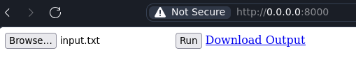

One of the first things you might want to do with Go Web Assembly is to handle files from the browser. In this post, we will see how to handle files in Go Web Assembly.

## Overview

In this project, we will define `processFile` from go, which reads a file from JavaScript, adds "Hello From Go" to the beginning of the file, and then returns the modified file back to JavaScript.

Using
1. **`func CopyBytesToGo(dst []byte, src Value) int`** and
2. **`func CopyBytesToJS(dst Value, src []byte) int`**

we can transfer data between JavaScript and Go efficiently.


## Writing out the site

We'll start with a basic HTML structure, featuring a file input and a button to trigger the file processing.

```html
<body>
  <input type="file" id="file" name="file" />
  <button id="run">Run</button>
  <a id="downloadBtn" disabled>Download Output</a>

  <script src="wasm_exec.js"></script>
  <script>
    // our main script will go here
  </script>
</body>
```

**Grab the wasm_exec script from the [go repo](https://github.com/golang/go/tree/master/misc/wasm)**

## Exporting functions from Go to Javascript

With the `syscall/js` package, we can export functions from Go to Javascript.

```go
package main

import (
	"syscall/js"
)

// function to export !
func processFile(this js.Value, args []js.Value) interface{} {
  // grab the file data from javascript
	fileDataJS := args[0]
	fileDataGo := make([]byte, fileDataJS.Get("byteLength").Int())

	js.CopyBytesToGo(fileDataGo, fileDataJS)

	header := []byte("Hello From Go\n")
	modifiedData := append(header, fileDataGo...)

	modifiedDataJS := js.Global().Get("Uint8Array").New(len(modifiedData))
	js.CopyBytesToJS(modifiedDataJS, modifiedData)

	return modifiedDataJS
}

func main() {
  // export processFile to javascript
	js.Global().Set("processFile", js.FuncOf(processFile))
  select {} // block
}
```

Compile the above `main.go` into `main.wasm` using the following command.

```bash
GOOS=js GOARCH=wasm go build -o wasm.wasm
```

You can use tinygo if you want to reduce the size of the wasm file.

## Calling Go functions from Javascript

We would have to write some bootstrap code in order to get a go instance running inside our javascript environment.

```js
// 1. Bootstrap the go runtime
const go = new Go();
let mod, inst;
WebAssembly.instantiateStreaming(fetch("main.wasm"), go.importObject).then((result) => {
    go.run(result.instance);
}).catch((err) => {
    console.error(err);
});
```

Now we can call our exported Go function from Javascript.
1. Read the file input as an ArrayBuffer, convert it into a Uint8Array, and pass it to our Go processFile function.
2. After Go returns the modified file, we create a downloadable link

```js
runBtn = document.getElementById('run');
runBtn.addEventListener('click', async () => {

    // 1. Read the file input
    const inputFile = document.getElementById('file').files[0];
    const arrayBuffer = await inputFile.arrayBuffer();
    const uint8Array = new Uint8Array(arrayBuffer);

    // 2. Call the Go function
    const outputFile = await processFile(uint8Array);
    createDownloadLink(outputFile);
});

async function createDownloadLink(uint8Array) {
    const blob = new Blob([uint8Array], {type: "application/octet-stream"});
    const url = URL.createObjectURL(blob);
    const link = document.getElementById("downloadBtn");
    link.href = url;
    link.download = "modified_file.txt";
    document.getElementById("downloadBtn").disabled = false;
}
```

If you quickly want to test this out, you can use the following command to serve the files locally.

```bash
python -m http.server
```

And that's it! We have successfully handled files in Go Web Assembly entirely from the browser.




## References

- [Stackoverflow (jordiburgos) - Is it possible to explicitly call an exported Go WebAssembly function from JS?](https://stackoverflow.com/questions/56398142/is-it-possible-to-explicitly-call-an-exported-go-webassembly-function-from-js)
- [Medium (Liron Navon) - Getting started with Web Assembly and Go for frontend developers.](https://medium.com/codesight/getting-started-with-web-assembly-and-go-for-frontend-developers-5e1831f0a18b)

